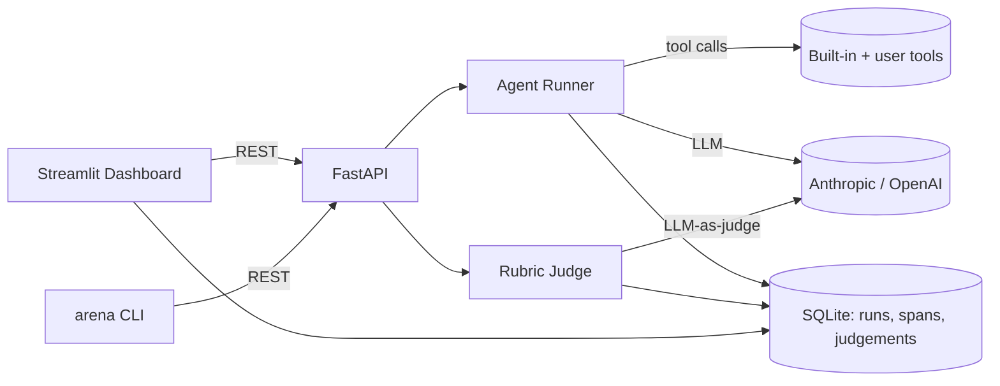

# AgentArena

[](https://github.com/agent-arena/agent-arena/actions/workflows/ci.yml)


**A/B test your LLM agents. Define configs, run task suites, judge outputs, compare head-to-head.**

Agent engineering has shifted from "can you make it work?" to "can you prove version B is better than A?" Existing tools are either SaaS, framework-specific, or non-visual. AgentArena is model-agnostic, self-hostable, has zero external infra beyond an LLM API key, and is designed for the specific workflow of A/B testing agent configs — the daily loop of an agent engineer.

---

## Status

M7 — Trace viewer for individual runs. Per-run detail page with a waterfall/timeline of spans, collapsible JSON inputs/outputs, judgements side panel, and deep-links from the per-task breakdown table in the Arena page.

**What M7 ships:**

- `dashboard/pages/5_Trace_Viewer.py` — per-run trace page: Plotly horizontal waterfall chart of spans (LLM=blue, tool=orange), collapsible expanders with JSON input/output, left panel with run metadata + per-criterion judgement scores and justifications; deep-linkable via `?run_id=<id>`
- `dashboard/pages/4_Arena.py` — per-task breakdown now renders clickable score cells that deep-link to the trace viewer (falls back to plain table if API unavailable)
- `api.py` — 4 new endpoints: `GET /runs/{run_id}`, `GET /runs/{run_id}/spans`, `GET /runs/{run_id}/judgements`, `GET /arena/{arena_id}/runs`
- `dashboard/api_client.py` — 4 new client methods: `get_run`, `get_run_spans`, `get_run_judgements`, `get_arena_run_list`
- `tests/test_trace_api.py` — 12 new tests covering 404 on missing run, span ordering (insertion order via rowid), judgement field presence, config_name resolution, and arena run list

**What M6 shipped:**

- `dashboard/app.py` — home page with API health indicator; entry point for `arena dashboard`
- `dashboard/pages/1_Configs.py` — full CRUD for agent configs (list, create, delete)
- `dashboard/pages/2_Task_Suites.py` — browse YAML task suites, inspect tasks in a dataframe
- `dashboard/pages/3_Rubrics.py` — browse YAML rubrics, inspect criteria in a dataframe
- `dashboard/pages/4_Arena.py` — run evaluations, Plotly radar chart + win-rate heatmap, per-task breakdown; **Run Demo** button calls `POST /arena/demo`
- `dashboard/api_client.py` — synchronous httpx wrapper with clear error messages
- `api.py` — 5 new endpoints: `GET /task-suites`, `GET /rubrics`, `DELETE /configs/{id}`, `GET /arena/runs/{id}`, `POST /arena/demo`
- `cli.py` — `arena dashboard` (launches Streamlit) and updated `arena demo` (prints instructions)
- 10 new tests in `tests/test_dashboard_api.py`

**What M5 shipped:**

- `judge.py` — `Judge` class: LLM-as-judge with one criterion per call, JSON parse with one retry, Anthropic + OpenAI support
- `arena.py` — `Arena` orchestrator: sequential config × task loop, persists `ArenaRun`, calls judge per run; `get_results()` returns `ArenaResults` with win rates, per-criterion `CriterionStats` (mean + bootstrap 95% CI), per-task breakdown
- `api.py` — FastAPI app: `POST /arena/run`, `GET /arena/results/{id}`, `GET/POST /configs`, `GET /arena/runs`
- `cli.py` — `arena run` (with live progress), `arena compare` (formatted table), `arena configs create/list`
- `models.py` — added `Judgement` and `ArenaRun` SQLModel tables
- 8 new tests (35 total): judge JSON parsing, retry logic, persistence, weighted scoring, bootstrap CI, win-rate invariants, end-to-end mocked run

**What M3 shipped:**

- `schemas.py` — `TaskItem`, `TaskSuiteConfig`, `CriterionConfig`, `RubricConfig` (Pydantic, `extra="forbid"`)
- `loaders.py` — `load_task_suite()`, `load_rubric()` with SHA-256 content hashing for versioning
- `examples/task_suites/` — `customer_support.yaml` (12 tasks), `code_review.yaml` (8 tasks), `math_word_problems.yaml` (10 tasks)
- `examples/rubrics/` — `helpfulness.yaml` (4 criteria), `safety.yaml` (3 criteria)
- CLI: `arena tasks list <path>` and `arena tasks show <path> <task-id>`
- 15 unit tests covering valid loads, validation errors, hash stability, and all example files

```bash
# Inspect a task suite
arena tasks list examples/task_suites/customer_support.yaml
arena tasks show examples/task_suites/customer_support.yaml cs-007

# Load programmatically
from agent_arena import load_task_suite, load_rubric
suite = load_task_suite("examples/task_suites/customer_support.yaml")
rubric = load_rubric("examples/rubrics/helpfulness.yaml")
print(suite.content_hash)  # SHA-256 fingerprint for versioning
```

**What M2 shipped:**

- `AgentConfig`, `Task`, `Run`, `Span` — Pydantic/SQLModel models persisted to SQLite
- `db.py` — `init_db()`, `get_session()`, configurable via `ARENA_DB_URL` env var
- `tools.py` — `calculator` (safe AST evaluator), `web_search_stub`, tool registry + `@tool` decorator
- `runner.py` — `AgentRunner` with Anthropic + OpenAI tool-calling loop; spans persisted per LLM/tool call; `max_turns` guard (default 10)
- 11 unit tests with mocked LLM clients and in-memory SQLite — no API key required for `pytest`

**What M1 shipped:**

- `src/agent_arena/` package with `py.typed` marker and `arena` CLI entry point
- `pyproject.toml` — hatchling build, ruff, pytest configuration
- `.pre-commit-config.yaml`, `.github/workflows/ci.yml`, MIT `LICENSE`, `.gitignore`

---

## Features

> Target feature set, implemented incrementally across M2–M9.

- **Unified agent runner** — Anthropic + OpenAI with tool-calling, single interface
- **Built-in tools** — `web_search_stub`, `calculator`, `python_exec_sandbox` + user-defined tool decorator
- **YAML task suites & rubrics** — version-control your evals alongside your code
- **LLM-as-judge** — per-criterion scoring (0–5) with written justification
- **Head-to-head aggregation** — win rates, per-criterion mean scores, per-task breakdowns, bootstrap 95% confidence intervals
- **Streamlit dashboard** — multi-page app: config CRUD, task/rubric browser, live progress bar, leaderboard, per-config radar chart, head-to-head win-rate heatmap; trace viewer (M7)

---

## Architecture



---

## Quickstart

```bash
git clone https://github.com/agent-arena/agent-arena.git
cd agent-arena
pip install -e ".[dev]"
export ANTHROPIC_API_KEY=sk-ant-...

# Run tests (no API key needed — uses mocked LLM clients)
pytest

# Inspect task suites
arena tasks list examples/task_suites/customer_support.yaml
arena tasks show examples/task_suites/customer_support.yaml cs-007

# Create agent configs
arena configs create "claude-baseline" anthropic claude-haiku-4-5-20251001
arena configs list   # prints IDs

# Run arena (requires ANTHROPIC_API_KEY)
arena run examples/task_suites/math_word_problems.yaml \
           examples/rubrics/helpfulness.yaml \
           -c <config-id-1> -c <config-id-2>

# Compare results
arena compare <arena-run-id>

# Start the REST API (terminal 1)
uvicorn agent_arena.api:app --reload

# Start the Streamlit dashboard (terminal 2)
arena dashboard

# Open http://localhost:8501, go to Arena page, click "Run Demo"
# After the run completes, click any score cell in the per-task breakdown
# table to open the Trace Viewer (page 5) for that run.
# Direct URL: http://localhost:8501/Trace_Viewer?run_id=<run-id>
```

---

## Roadmap

| Milestone | Description | Status |
|-----------|-------------|--------|
| M1 | Scaffold: repo layout, pyproject.toml, CI, pre-commit, LICENSE | Done |
| M2 | Core agent runner + provider abstraction + SQLite persistence | Done |
| M3 | YAML task suites + rubrics; content hashing; CLI `arena tasks` | Done |
| M4 | LLM-as-judge with YAML rubrics | Done |
| M5 | Arena engine: head-to-head aggregation + FastAPI + CLI | Done |
| M6 | Streamlit dashboard: config manager + task browser + leaderboard + heatmap | Done |
| M7 | Trace viewer: per-run waterfall, judgements panel, deep-links | Done |
| M8 | demo.gif + docs | |

---

## Contributing

PRs welcome — run `pre-commit install` first.

---

## License

MIT
