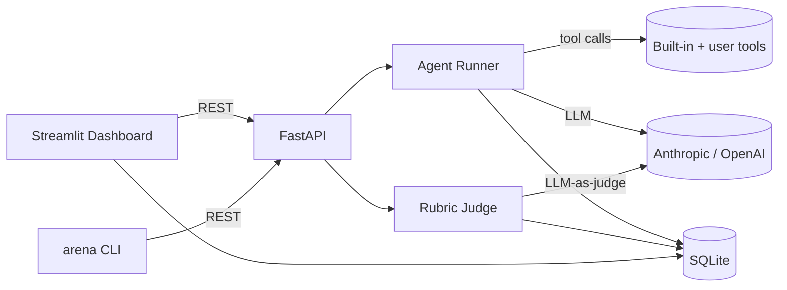

# AgentArena


> **Video walkthrough:** https://youtu.be/G1DcT4BMSz4
> **60-second overview:** https://youtu.be/31n8B-MZrkM

> Pit two agent configurations against each other on real tasks, score with rubric-based LLM-as-judge, and visualize win rates + traces in a live dashboard.

[](https://github.com/RitikPatill/agent-arena/actions/workflows/ci.yml)


<!-- TODO: replace with a 5-10 second demo gif. Record with ScreenToGif on
     Windows or peek on macOS. Save to docs/demo.gif and update path here. -->


## What it is

AgentArena is a self-hostable evaluation harness for LLM agents. You define an **agent config** (system prompt, model, tools, temperature), a **task suite** (input cases with optional reference answers stored as YAML), and a **rubric** (weighted criteria such as correctness, tool-use efficiency, safety, and format). AgentArena runs one or more configs against every task, invokes a separate judge model to score each output per criterion, and aggregates results into head-to-head win rates backed by bootstrap confidence intervals.

The workflow maps to a question agent engineers ask every day: is version B actually better than A, and on which tasks does it fall short? Everything runs locally against your own API key — no external services, no data leaves your machine, and all runs, spans, and judgements land in a local SQLite file you can query directly.

## Quickstart

```bash
git clone https://github.com/RitikPatill/agent-arena.git
cd agent-arena
pip install -e ".[dev]"
export ANTHROPIC_API_KEY=sk-ant-...

# Verify the install — all LLM calls are mocked, no key needed
pytest

# Run the demo: 2 configs × 3 tasks, prints a win-rate matrix
python examples/quickstart.py
```

For the full visual experience:

```bash
# Terminal 1 — start the REST API
uvicorn agent_arena.api:app --reload

# Terminal 2 — start the dashboard at http://localhost:8501
arena dashboard
```

Open the **Arena** page, click **Run Demo**, then click any score cell to open the Trace Viewer.

## Usage

**CLI workflow** — define configs, run an eval, compare results:

```bash
# Create two configs to compare
arena configs create "claude-baseline"      anthropic claude-haiku-4-5-20251001
arena configs create "claude-cot-reflect"  anthropic claude-haiku-4-5-20251001

# Run both configs against a task suite + rubric
arena run examples/task_suites/customer_support.yaml \
           examples/rubrics/helpfulness.yaml \
           -c <config-id-1> -c <config-id-2>

# Print the head-to-head summary
arena compare <arena-run-id>
```

The dashboard gives the same workflow with a UI: pick a task suite and rubric, select two configs, click **Run Arena**, and watch tasks stream in as they complete. When the judge phase finishes a radar chart and per-task heatmap populate. Click any cell to open the trace viewer — a waterfall timeline of every LLM call and tool call in that run, with the judge's written justification alongside.

**Adding your own tools** — decorate any callable with `@tool` from `agent_arena.tools` and it becomes available to any config at runtime. See [CONTRIBUTING.md](CONTRIBUTING.md) for details.

## Architecture



The Streamlit dashboard and CLI both speak to a FastAPI process over REST, keeping the Streamlit sandbox isolated and the backend independently testable. The Agent Runner executes tool-calling loops; the Rubric Judge fires one LLM call per criterion and persists scored `Judgement` rows. See [docs/ARCHITECTURE.md](docs/ARCHITECTURE.md) for the full data-model reference and judging methodology.

## Project structure

```
src/agent_arena/     Core library — runner, judge, models, API, CLI, dashboard
examples/            Sample task suites (YAML) and rubrics (YAML) + quickstart script
tests/               Pytest suite; all LLM calls mocked — runs offline
docs/                Architecture reference, demo gif, screenshots
scripts/             Helper scripts (e.g. demo recording)
```

## Roadmap

- [ ] LangGraph / CrewAI adapter — register any agent graph as an `AgentConfig`
- [ ] Cost tracking — token price per run with optional budget guardrails
- [ ] Async parallel runner — `asyncio` concurrency with configurable worker count
- [ ] `arena assert` CI gate — exits 1 when win-rate drops below a threshold
- [ ] Human-in-the-loop labeling — override judge scores directly in the dashboard

## License

MIT — see LICENSE.

---

Built autonomously by [autodev](https://github.com/RitikPatill/autodev),
a multi-agent orchestrator I designed. Each commit in this repo was
authored by me; the implementation work was performed by Sonnet under
the orchestrator's control. Read the orchestrator's README to see how.
