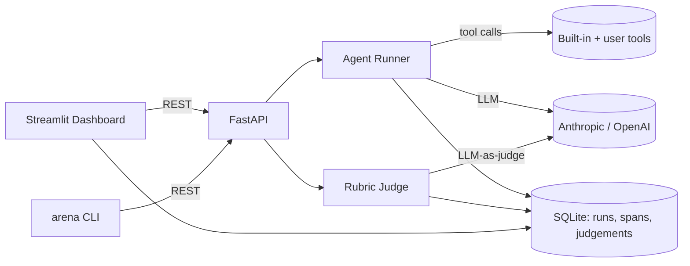

# AgentArena

[](https://github.com/agent-arena/agent-arena/actions/workflows/ci.yml)


**A/B test your LLM agents. Define configs, run task suites, judge outputs, compare head-to-head.**

Agent engineering has shifted from "can you make it work?" to "can you prove version B is better than A?" Existing tools are either SaaS, framework-specific, or non-visual. AgentArena is model-agnostic, self-hostable, has zero external infra beyond an LLM API key, and is designed for the specific workflow of A/B testing agent configs — the daily loop of an agent engineer.

---

## Status

M2 — core agent runner complete. Provider-agnostic `AgentRunner`, SQLite persistence, and built-in tools are implemented and tested.

**What M2 ships:**

- `AgentConfig`, `Task`, `Run`, `Span` — Pydantic/SQLModel models persisted to SQLite
- `db.py` — `init_db()`, `get_session()`, configurable via `ARENA_DB_URL` env var
- `tools.py` — `calculator` (safe AST evaluator), `web_search_stub`, tool registry + `@tool` decorator
- `runner.py` — `AgentRunner` with Anthropic + OpenAI tool-calling loop; spans persisted per LLM/tool call; `max_turns` guard (default 10)
- 11 unit tests with mocked LLM clients and in-memory SQLite — no API key required for `pytest`

**What M1 shipped:**

- `src/agent_arena/` package with `py.typed` marker and `arena` CLI entry point
- `pyproject.toml` — hatchling build, ruff, pytest configuration
- `.pre-commit-config.yaml`, `.github/workflows/ci.yml`, MIT `LICENSE`, `.gitignore`

---

## Features

> Target feature set, implemented incrementally across M2–M9.

- **Unified agent runner** — Anthropic + OpenAI with tool-calling, single interface
- **Built-in tools** — `web_search_stub`, `calculator`, `python_exec_sandbox` + user-defined tool decorator
- **YAML task suites & rubrics** — version-control your evals alongside your code
- **LLM-as-judge** — per-criterion scoring (0–5) with written justification
- **Head-to-head aggregation** — win rates, mean scores, per-task breakdowns
- **Streamlit dashboard** — live run view, leaderboard, heatmap, trace viewer

---

## Architecture



---

## Quickstart

```bash
git clone https://github.com/agent-arena/agent-arena.git
cd agent-arena
pip install -e ".[dev]"
export ANTHROPIC_API_KEY=sk-ant-...

# Run tests (no API key needed — uses mocked LLM clients)
pytest

# Use the runner directly
python - <<'EOF'
from agent_arena import AgentConfig, AgentRunner, Task, init_db
from sqlmodel import Session, create_engine

init_db()
engine = create_engine("sqlite:///arena.db", connect_args={"check_same_thread": False})
with Session(engine) as session:
    config = AgentConfig(
        name="demo", provider="anthropic", model="claude-3-haiku-20240307",
        system_prompt="You are a helpful assistant.", tools=["calculator"], params={},
    )
    session.add(config); session.commit()
    runner = AgentRunner(config, session)
    run = runner.run(Task(input="What is 123 * 456?"))
    print(run.status, run.output)
EOF
```

> Full CLI (`arena run`, `arena demo`) and the Streamlit dashboard are coming in M5+.

---

## Roadmap

| Milestone | Description | Status |
|-----------|-------------|--------|
| M1 | Scaffold: repo layout, pyproject.toml, CI, pre-commit, LICENSE | Done |
| M2 | Core agent runner + provider abstraction + SQLite persistence | Done |
| M3 | YAML task suites; `python_exec_sandbox` tool | |
| M4 | LLM-as-judge with YAML rubrics | |
| M5 | FastAPI backend + CLI (`arena run` / `judge` / `compare`) | |
| M6 | Streamlit dashboard: config manager + task browser | |
| M7 | Live run view + leaderboard + head-to-head heatmap | |
| M8 | Trace viewer + demo.gif + docs | |

---

## Contributing

PRs welcome — run `pre-commit install` first.

---

## License

MIT
