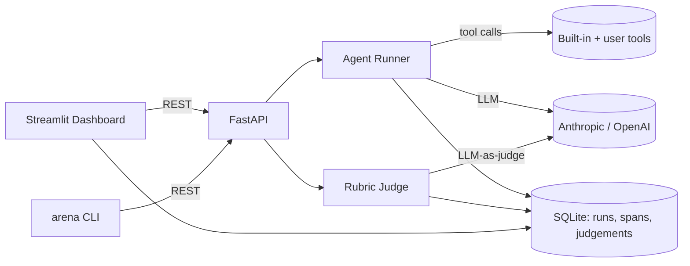

# AgentArena

[](https://github.com/agent-arena/agent-arena/actions/workflows/ci.yml)


**A/B test your LLM agents. Define configs, run task suites, judge outputs, compare head-to-head.**

Agent engineering has shifted from "can you make it work?" to "can you prove version B is better than A?" Existing tools are either SaaS, framework-specific, or non-visual. AgentArena is model-agnostic, self-hostable, has zero external infra beyond an LLM API key, and is designed for the specific workflow of A/B testing agent configs — the daily loop of an agent engineer.

---

## Status

M1 — scaffold complete. The repo layout, tooling, and CI pipeline are in place. No runtime features are implemented yet; all items in [Features](#features) are planned for M2–M9.

**What M1 ships:**

- `src/agent_arena/` package with `py.typed` marker and `arena` CLI entry point registered via `pyproject.toml`
- `tests/` with a smoke test confirming the package is importable
- `examples/` and `docs/` directories (stubs, populated in later milestones)
- `pyproject.toml` — hatchling build backend, full dependency declarations, ruff and pytest configuration
- `.pre-commit-config.yaml` — ruff lint and format hooks
- `.github/workflows/ci.yml` — lint (`ruff check`) and test (`pytest`) on every push and pull request
- MIT `LICENSE` and `.gitignore`

---

## Features

> Target feature set, implemented incrementally across M2–M9.

- **Unified agent runner** — Anthropic + OpenAI with tool-calling, single interface
- **Built-in tools** — `web_search_stub`, `calculator`, `python_exec_sandbox` + user-defined tool decorator
- **YAML task suites & rubrics** — version-control your evals alongside your code
- **LLM-as-judge** — per-criterion scoring (0–5) with written justification
- **Head-to-head aggregation** — win rates, mean scores, per-task breakdowns
- **Streamlit dashboard** — live run view, leaderboard, heatmap, trace viewer

---

## Architecture



---

## Quickstart

> The commands below will work once M3 (agent runner) and M6 (CLI) are complete. The package installs cleanly today and the `arena` entry point is registered.

```bash
git clone https://github.com/agent-arena/agent-arena.git
cd agent-arena
pip install -e .
export ANTHROPIC_API_KEY=sk-ant-...
arena demo
```

---

## Roadmap

| Milestone | Description | Status |
|-----------|-------------|--------|
| M1 | Scaffold: repo layout, pyproject.toml, CI, pre-commit, LICENSE | Done |
| M2 | Data models + SQLite persistence (Run, Span, Judgement) | |
| M3 | Agent runner with Anthropic + OpenAI tool-calling | |
| M4 | Built-in tools: calculator, web_search_stub, python_exec_sandbox | |
| M5 | LLM-as-judge with YAML rubrics | |
| M6 | FastAPI backend + CLI (arena run / judge / compare) | |
| M7 | Streamlit dashboard: config manager + task browser | |
| M8 | Live run view + leaderboard + head-to-head heatmap | |
| M9 | Trace viewer + demo.gif + docs | |

---

## Contributing

PRs welcome — run `pre-commit install` first.

---

## License

MIT
