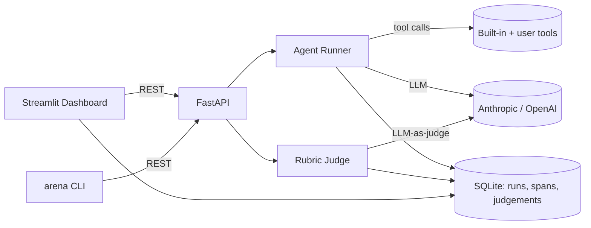

# AgentArena — Architecture

This document covers the system design, data model, judging methodology, and aggregation formulas in detail. For a high-level overview, see the [README](../README.md).

---

## 1. Overview



The system has four layers:

**Clients** — The Streamlit dashboard and the `arena` CLI are the two entry points. Both speak to the FastAPI backend over HTTP/REST rather than importing the Python modules directly. This boundary exists for two reasons: (1) Streamlit runs its own event loop in a restricted sandbox, making direct imports fragile; (2) keeping the backend REST-accessible makes it independently testable with `pytest` + `httpx.TestClient` and opens a path to remote execution without changing the client code.

**FastAPI backend** (`src/agent_arena/api.py`) — A thin orchestration layer. It validates requests, resolves database sessions, and delegates to `AgentRunner` and `Judge`. It also serves the read-heavy endpoints (list configs, get results, get spans) that the dashboard polls.

**Agent Runner** (`src/agent_arena/runner.py`) — Executes a single `AgentConfig` against a single `Task`. Drives a tool-calling loop: send messages to the LLM, execute any requested tools, append results, repeat until the model stops calling tools or `max_turns` is reached. Each LLM call and tool call is recorded as a `Span` row in SQLite.

**Rubric Judge** (`src/agent_arena/judge.py`) — After the runner completes a `Run`, the judge scores the output. It fires one LLM call per rubric criterion (see §3) and persists a `Judgement` row per criterion.

---

## 2. Data model

All persisted models use SQLModel (SQLAlchemy + Pydantic). The database is a local SQLite file, configurable via the `ARENA_DB_URL` environment variable (defaults to `arena.db` in the working directory).

### `AgentConfig`

Persisted agent configuration. Created by the user via the dashboard or CLI and referenced by `Run`.

| Column | Type | Purpose |
|---|---|---|
| `id` | `str` (UUID) | Primary key |
| `name` | `str` | Human-readable label (e.g. `claude-baseline`) |
| `provider` | `str` | `"anthropic"` or `"openai"` |
| `model` | `str` | Model ID passed to the SDK (e.g. `claude-haiku-4-5-20251001`) |
| `system_prompt` | `str` | System prompt injected at the start of every run |
| `tools` | `list` (JSON) | List of tool names to expose to this agent |
| `params` | `dict` (JSON) | Extra provider params (e.g. `temperature`, `max_tokens`) |

### `Run`

One execution of one `AgentConfig` against one task.

| Column | Type | Purpose |
|---|---|---|
| `id` | `str` (UUID) | Primary key |
| `arena_run_id` | `str \| None` | FK to `ArenaRun`; `None` for standalone runs |
| `config_id` | `str` | FK to `AgentConfig` |
| `task_id` | `str` | Task identifier from the YAML suite |
| `output` | `str \| None` | Final agent response text |
| `status` | `str` | `pending \| running \| done \| error` |
| `started_at` | `datetime` | UTC timestamp |
| `finished_at` | `datetime \| None` | UTC timestamp; `None` if still running |
| `error` | `str \| None` | Exception message on error |

### `Span`

One LLM call or tool call within a `Run`. Used by the trace viewer to render the waterfall timeline.

| Column | Type | Purpose |
|---|---|---|
| `id` | `str` (UUID) | Primary key |
| `run_id` | `str` | FK to `Run` |
| `kind` | `str` | `"llm"` or `"tool"` |
| `name` | `str` | Model name (LLM spans) or tool name (tool spans) |
| `input` | `str` | JSON-serialised input (messages list or tool arguments) |
| `output` | `str` | JSON-serialised output (response text or tool result) |
| `latency_ms` | `int` | Wall-clock duration of the call |
| `tokens` | `int \| None` | Total tokens (LLM spans only; `None` for tool spans) |

### `Judgement`

One LLM-as-judge score for one criterion of one `Run`.

| Column | Type | Purpose |
|---|---|---|
| `id` | `str` (UUID) | Primary key |
| `run_id` | `str` | FK to `Run` |
| `rubric_id` | `str` | SHA-256 content hash of the rubric YAML file |
| `criterion` | `str` | Criterion name (e.g. `"correctness"`) |
| `score` | `float` | Raw score in `[0, criterion.scale]` |
| `justification` | `str` | One-sentence justification from the judge LLM |
| `judge_model` | `str` | Model ID used for judging |

### `ArenaRun`

One full evaluation: N configs × all tasks in a suite.

| Column | Type | Purpose |
|---|---|---|
| `id` | `str` (UUID) | Primary key |
| `config_ids` | `list` (JSON) | Ordered list of `AgentConfig` IDs in this run |
| `task_suite_hash` | `str` | SHA-256 of the task suite YAML |
| `rubric_hash` | `str` | SHA-256 of the rubric YAML |
| `status` | `str` | `pending \| running \| done \| error` |
| `created_at` | `datetime` | UTC timestamp |
| `finished_at` | `datetime \| None` | UTC timestamp |
| `error` | `str \| None` | Exception message on error |

### Non-persisted models

**`Task`** (Pydantic `BaseModel`) — In-memory task definition loaded from a YAML task suite. Fields: `id`, `input`, `reference` (optional), `meta` (dict). Not stored independently in SQLite; the `task_id` string is stored on `Run` and resolved back to the YAML at query time.

**`TaskSuiteConfig` / `RubricConfig`** (Pydantic) — YAML-loaded config objects with a computed `content_hash` (SHA-256 of the raw file bytes). Used at runtime; not stored in SQLite beyond the hash reference on `ArenaRun`.

---

## 3. Judging methodology

### Judge prompt

The judge receives one prompt per criterion. Here is the exact template (`src/agent_arena/judge.py:12-25`):

```
You are an impartial evaluator. Score the agent response on the criterion below.

CRITERION: {criterion_name}
DESCRIPTION: {criterion_description}
SCALE: 0 to {criterion_scale} (higher is better)

TASK INPUT:
{task_input}
{reference_block}
AGENT RESPONSE:
{output}

Reply ONLY with a JSON object: {"score": <int>, "justification": "<one sentence>"}
```

`{reference_block}` is empty when no reference answer is provided; otherwise it is `REFERENCE ANSWER:\n{reference}\n`.

### Why one call per criterion

Scoring all criteria in a single LLM call introduces **position bias**: the model tends to give higher scores to criteria listed first and anchors later scores to earlier ones. Isolating each criterion to its own call prevents inter-criterion contamination and makes the scores easier to audit (each justification is unambiguously tied to one criterion).

### JSON retry logic

The judge expects a JSON object `{"score": int, "justification": str}`. If the first response cannot be parsed (e.g. the model wraps the JSON in a markdown code fence or adds prose), the judge fires a second call with a correction message that includes the raw bad response and repeats the format requirement. If the second response also fails to parse, a `ValueError` is raised and the run is marked `error`.

Markdown code fences are stripped before `json.loads` as a first-pass fix, so well-formatted responses with fences succeed without a retry.

### Known limitations

- **Ordinal, not interval**: A score of 5 is better than 4, but the _gap_ between 4 and 5 is not necessarily equal to the gap between 1 and 2. Treat raw criterion means as rankings, not measurements.
- **Rubric wording sensitivity**: Small changes in `criterion_description` can shift scores by 1–2 points. Treat rubrics as fixed within a comparison; never compare runs scored with different rubric versions.
- **Judge inconsistency on borderline cases**: LLM judges show higher variance on scores of 2–3 (borderline responses). Bootstrap confidence intervals capture this variance, but do not eliminate it.
- **Self-judging bias**: If the same model and provider are used for both the agent and the judge, the judge may be systematically lenient toward its own output style. Use a different model or provider for the judge when possible.

---

## 4. Aggregation

### Weighted score

For a given `Run`, the weighted score normalises each criterion score to `[0, 1]` and takes a weighted average:

```
weighted_score(run) =
    sum(criterion.weight * (score / criterion.scale) for each judgement)
    / sum(criterion.weight for each judgement)
```

The result is a single float in `[0, 1]`. This is the value stored in `per_task[task_id][config_id]` in `ArenaResults`.

### Win rate

Config A **wins** task T against config B if `weighted_score(A, T) > weighted_score(B, T)`. Ties (within `1e-9`) are split 0.5 each way.

```
win_rate(A vs B) = (wins + 0.5 * ties) / total_tasks
```

Self-comparison always returns 0.5. Win rates are the primary ranking signal — they are more robust than raw criterion means because they are invariant to score scale and rubric weighting choices.

### Bootstrap confidence intervals

Per-criterion mean scores include a 95% bootstrap CI computed with 1 000 resampling iterations (seed = 42 for reproducibility):

```python
def _bootstrap_ci(values, n_iter=1000, alpha=0.05, seed=42):
    rng = random.Random(seed)
    n = len(values)
    means = sorted(
        sum(rng.choices(values, k=n)) / n
        for _ in range(n_iter)
    )
    return means[int(alpha/2 * n_iter)], means[int((1-alpha/2) * n_iter) - 1]
```

CIs are wide when the task count is small (< 10) and should be interpreted with caution. They are displayed in the dashboard radar chart as error bars.
